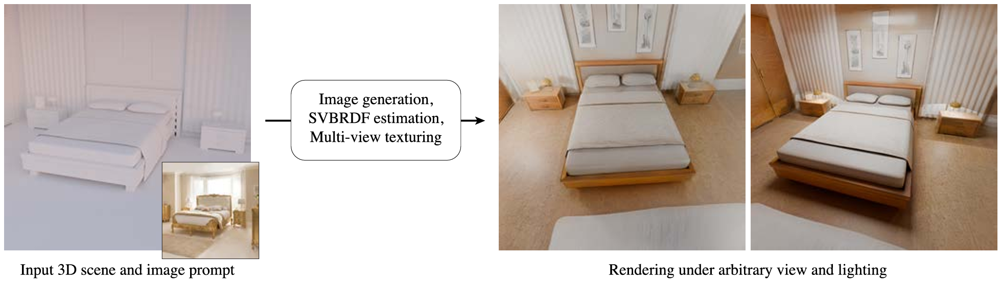
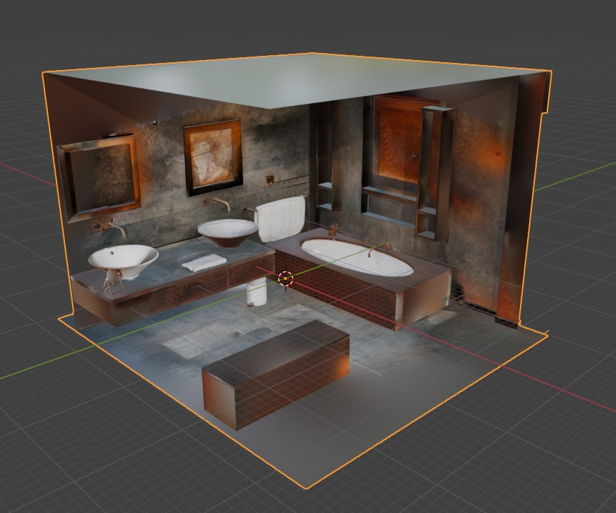

# An evaluation of SVBRDF Prediction from Generative Image Models for Appearance Modeling of 3D Scenes



**An evaluation of SVBRDF Prediction from Generative Image Models for Appearance Modeling of 3D Scenes**<br>
[Alban Gauthier](https://albangauthier.github.io),
[Valentin Deschaintre](https://valentin.deschaintre.fr/),
[Alexandre Lanvin](https://github.com/alanvinx),
[Fredo Durand](https://people.csail.mit.edu/fredo/),
[Adrien Bousseau](http://www-sop.inria.fr/members/Adrien.Bousseau/),
[George Drettakis](http://www-sop.inria.fr/members/George.Drettakis/) <br>
*Eurographics Symposium on Rendering 2025 (Symposium Track)* <br>
## [Project page](https://repo-sam.inria.fr/nerphys/svbrdf-evaluation/) | [Paper](https://repo-sam.inria.fr/nerphys/svbrdf-evaluation/MultiviewSceneMaterials_authors.pdf) | [Digital Library](https://diglib.eg.org/handle/10.2312/sr20251186)

## 📖 BibTeX
```tex
@inproceedings{gauthier2025evaluation,
    booktitle = {Eurographics Symposium on Rendering},
    title = {{An evaluation of SVBRDF Prediction from Generative Image Models for Appearance Modeling of 3D Scenes}},
    author = {Gauthier, Alban and Deschaintre, Valentin and Lanvin, Alexandre and Durand, Fredo and Bousseau, Adrien and Drettakis, George},
    year = {2025},
    publisher = {The Eurographics Association},
}
```

# 💡 Usage

## 🐍 Python env

```sh
git clone https://github.com/graphdeco-inria/svbrdf-evaluation
cd svbrdf-evaluation

conda create -n svbrdf_eval python=3.10
conda activate svbrdf_eval
pip install -r requirements.txt
```

The environment and inference code have been tested on Windows 10/11 with RTX 3080Ti and 3090.

## 🔧 Model checkpoints

IP-Adapter checkpoint (to put in ./thirdparty/ip_adapter/models):  
https://huggingface.co/h94/IP-Adapter/resolve/main/models/ip-adapter-plus_sd15.bin  

UNet-HF checkpoints (to put in ./checkpoints):  
https://repo-sam.inria.fr/nerphys/svbrdf-evaluation/data/unet_hf.zip  
And for SVBRDF estimation without normals and depth:  
https://repo-sam.inria.fr/nerphys/svbrdf-evaluation/data/unet_hf_nogeom.zip 

## 💻 Running

Download the necessary data to run the experiment:
https://repo-sam.inria.fr/nerphys/svbrdf-evaluation/data/bathroom.zip  

Running the diffusion model and controlnets require ~10GB of Disk Space.

### ✨ PBR Material Scene texturing

1st: Generate View-space PBR maps

```
python generation_pipeline.py
```


<details>
<summary>Parameters</summary>

```
--input_dir (default: "./data/bathroom")
Directory containing all necessary data to texture the scene with PBR materials (depths, normals, linearts, cameras)

--output_folder (default: "./output/bathroom")
Directory to output the viewspace PBR maps to bake for the next step

--sensor_count (default: 5)
Number of cameras used to generate view-space PBR textures

--prompt (default: "A cozy rustic bathroom ...")
Text prompt for text-based generation of PBR textures

--ckpt_folder (default: "checkpoints/unet_hf/")
Checkpoint directory for the SVBRDF estimator

--ckpt_name (default: "UNet_HF_val_loss=0.435621.ckpt")
Checkpoint name of the SVBRDF estimator

--conf_name (default: "config_UNet_HF_val_loss=0.435621.yaml")
Name of the conf file linked with the ckpt

--seed (default: 1200)
Seed to vary the texture generation

--output_gen_images (default: False)
Output only the generated RGB images (not the SVBRDFs)

```
</details>  
<br>

2nd: Bake them onto the original mesh
```
python project_texture.py
```


<details>
<summary>Parameters</summary>

```
--blender_exe (default: "C:/Program Files/Blender Foundation/Blender 4.2/blender.exe")
Directory containing the Blender executable

--scene_dir (default: "./data/bathroom/")
Directory containing the scene files (.ply, .out)

--svbrdf_dir (default: "./output/bathroom")
Directory containing the output of the generation pipeline

--output_dir (default: "./output/rustic_1200_output")
Directory to output the Blender file with PBR Textures

--meshlab_plyfile (default: "bathroom_meshlab.ply")
Name of the Meshlab PLY file 

--blender_plyfile (default: "bathroom_blender.ply")
Name of the Blender PLY file 

--bundler_file (default: "bundler.out")
Name of the Bundler file with camera information 

--method_name (default: "UNet_HF")
Name of the method used to compute SVBRDFs

```
</details>  
<br>

You should be able to open the output file in Blender, and it should look like this:



### 🌟 PBR Estimation

#### Using UNet-HF


```
python inference_UNet_HF.py
```

For now, the estimation only works for images which size is compatible with SD1.5 VAE.

<details>
<summary>Parameters</summary>

```
--input_dir (default: "./data/bathroom") 
Directory containing the image, normal and depth maps

--output_folder (default: "./output/bathroom")
Directory to output the SVBRDF

--img_name (default: "img_seed1200_00.png")
Name of the image to estimate the SVBRDF from

--ckpt_folder (default: "checkpoints/unet_hf/")
Checkpoint directory for the SVBRDF estimator

--ckpt_name (default: "UNet_HF_val_loss=0.435621.ckpt")
Checkpoint name of the SVBRDF estimator

--conf_name (default: "config_UNet_HF_val_loss=0.435621.yaml")
Name of the conf file linked with the ckpt


```
</details>  
<br>

## 🚀 TODO List:

Upon requests (via github issues)

- \[✅\] Scene texturing code
- \[🚀\] Dataset upload (or code to denoise and filter)
- \[🚀\] Training code
- \[🚀\] Blender scene export scripts
- \[🚀\] Per-view SVBRDF estimation  
    - \[✅\] UNet-HF with Geom
    - \[✅\] UNet-HF without Geom
    - \[🚀\] UNet-RGB with Geom
    - \[🚀\] UNet-RGB without Geom
    - \[🚀\] GenPercept with Geom
    - \[🚀\] GenPercept without Geom


## 🤗 Acknowledgements

**Thanks to the following open-sourced codebase for their wonderful work and codebase!**

- [Diffusion Hyperfeatures](https://github.com/diffusion-hyperfeatures/diffusion_hyperfeatures)
- [IP-Adapter](https://github.com/tencent-ailab/IP-Adapter)
- [diffusers](https://github.com/huggingface/diffusers)

## License (MIT)

```
Copyright (c) 2025 - INRIA - Alban Gauthier

Permission is hereby granted, free of charge, to any person obtaining a copy
of this software and associated documentation files (the “Software”), to
deal in the Software without restriction, including without limitation the
rights to use, copy, modify, merge, publish, distribute, sublicense, and/or
sell copies of the Software, and to permit persons to whom the Software is
furnished to do so, subject to the following conditions:

The above copyright notice and this permission notice shall be included in
all copies or substantial portions of the Software.

The Software is provided “as is”, without warranty of any kind, express or
implied, including but not limited to the warranties of merchantability,
fitness for a particular purpose and non-infringement. In no event shall the
authors or copyright holders be liable for any claim, damages or other
liability, whether in an action of contract, tort or otherwise, arising
from, out of or in connection with the software or the use or other dealings
in the Software.
```
